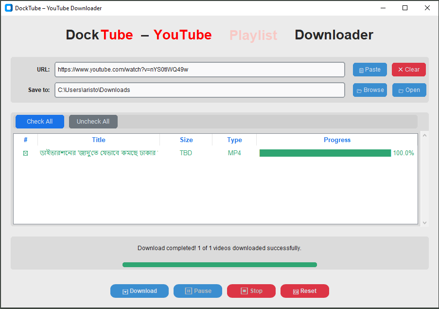

# DockTube – YouTube Downloader

**DockTube** is a lightweight, user-friendly YouTube downloader built with Python and `yt-dlp`.  
It can download **single videos** as well as **entire playlists**, making it easy to manage and save YouTube content on your PC.

---

## Features

- Fetch video or playlist information from YouTube  
- Select multiple videos for batch download  
- Download high-quality videos in MP4 format  
- Optional metadata embedding  
- Pause, resume, and stop downloads  
- Portable — works on Windows without installing Python

---

## Screenshots

### Main Interface

### Download Animation / Progress

  

---

## Installation

1. Download the latest `DockTube` executable from the releases.  
2. Place it anywhere on your Windows PC.  
3. Run the `.exe` — no installation required.  

> ⚠️ If building from source, ensure `yt-dlp.exe` is in the same folder.

---

## Usage

1. Open DockTube Downloader.  
2. Enter a YouTube video or playlist URL.  
3. **Wait a few seconds while DockTube fetches the video/playlist information.**  
4. Click **Fetch** to retrieve video details.  
5. Select the videos you want to download.  
6. Choose a save location.  
7. Click **Download** to start downloading videos or the entire playlist.

---

## Notes

- Downloads only video files (MP4) to avoid errors from thumbnails (.webp or .jpg).  
- FFmpeg is optional if you skip merging separate video and audio streams.  
- Works best on Windows 10/11.

---

## License

MIT License © 2025
